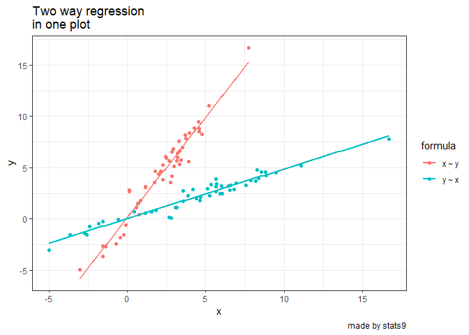

Plot two way regression with ggplot package
================

## get regline for x \~ y and y \~ x with ggplot

``` r
library(tidyverse)
library(ggpubr)
tibble(x = rnorm(50, 2, 2), 
y = 2 * x + rnorm(50, 0, 1)) %>%
gather(key = "vars", value = "values") %>%
mutate(id = 1:nrow(.)) %>%
relocate("id", .before = "vars") %>%
mutate(values2 = values[c(51:nrow(.), 
1:50)], 
id2 = case_when(vars == "x" ~ "x ~ y", 
TRUE ~ "y ~ x")) %>%
ggplot(aes(x = values, y = values2, colour = id2)) + 
geom_point() +
geom_smooth(method = "lm", aes(group = id2), 
formula = y ~ x, se = FALSE) + 
labs(x = "x", y = "y", title = "Two way regression 
in one plot", caption = "made by stats9") +
theme_bw() + 
guides(color = guide_legend(title = "formula"))
```

<!-- -->
